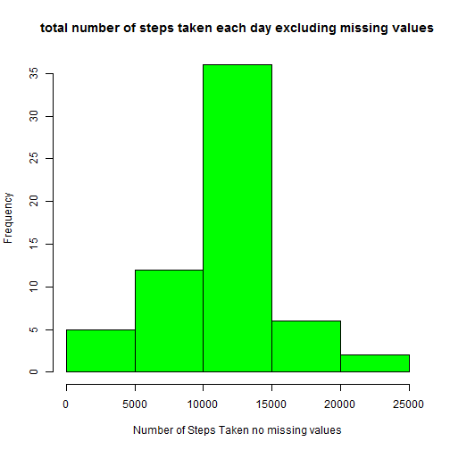

# Loading and preprocessing the data


```r
setwd("D:/dir1/data scientist/reproducable data")
unzip("activity.zip")
data <- read.csv("activity.csv", colClasses = c("numeric", "character", 
                                                "numeric"))
data_date <- as.Date(data$date, "%Y-%m-%d")
```

# What is mean total number of steps taken per day?

## Caculating the total number of steps taken per day


```r
total_steps <- aggregate(steps ~ data_date, data, sum, na.rm = TRUE)
```

## Making a histogram of the total number of steps taken each day


```r
hist(total_steps$steps, col="purple", xlab="Number of Steps Taken", main="total number of steps taken each day" )
```

 

## Calculate and report the mean and median of the total number of steps taken per day


```r
mean(total_steps$steps)
```

```
## [1] 10766.19
```

```r
median(total_steps$steps)
```

```
## [1] 10765
```

# What is the average daily activity pattern?

## Making a time series plot (i.e. type = "l") of the 5-minute interval (x-axis) and the average number of steps taken, averaged across all days (y-axis)


```r
average_steps <- aggregate(steps ~ interval, data, mean, na.rm = TRUE)

interval_int<-as.integer(average_steps$interval)
plot(average_steps$steps~interval_int, type="l", col="blue", main="average daily activity pattern", xlab="interval", ylab="average number of steps taken")
```

 

## Which 5-minute interval, on average across all the days in the dataset, contains the maximum number of steps?


```r
max_interval <- average_steps[which.max(average_steps$steps),1]
max_interval
```

```
## [1] 835
```

# Imputing missing values

## Calculate and report the total number of missing values in the dataset (i.e. the total number of rows with NAs)


```r
missing<-sum(is.na(data))
missing
```

```
## [1] 2304
```

## Devise a strategy for filling in all of the missing values in the dataset. The strategy used is replacing missing values with 5 minute inteval mean


```r
replaced <- function(steps, interval) {
  steps_missing <- NA
  if (!is.na(steps))
    steps_missing <- c(steps)
  else
    steps_missing <- (average_steps[average_steps$interval==interval, "steps"])
  return(steps_missing)
}
```

## Create a new dataset that is equal to the original dataset but with the missing data filled in.


```r
new.data <- data
new.data$steps <- mapply(replaced, new.data$steps, new.data$interval)
```

## Make a histogram of the total number of steps taken each day and Calculate and report the mean and median total number of steps taken per day.


```r
new_total_steps <- aggregate(steps ~ data_date, new.data, sum, na.rm = TRUE)
hist(new_total_steps$steps, col="green", xlab="Number of Steps Taken no missing values", main="total number of steps taken each day excluding missing values" )
```

 

```r
mean(new_total_steps$steps)
```

```
## [1] 10766.19
```

```r
median(new_total_steps$steps)
```

```
## [1] 10766.19
```

## Do these values differ from the estimates from the first part of the assignment? What is the impact of imputing missing data on the estimates of the total daily number of steps?

The means after replacing the missing values are a little different. The impact is minor.

# Are there differences in activity patterns between weekdays and weekends?

## Create a new factor variable in the dataset with two levels - "weekday" and "weekend" indicating whether a given date is a weekday or weekend day.


```r
new.data$weekend <- ifelse(weekdays(as.Date(new.data$date)) %in% c("Monday", "Tuesday", "Wednesday", "Thursday", "Friday"), 
                           "weekday", "weekend")
#creating a new average steps
average_steps_new<-aggregate(steps ~ interval + weekend, new.data, mean)

interval_int_new<-as.integer(average_steps_new$interval)
```

## Make a panel plot containing a time series plot (i.e. type = "l") of the 5-minute interval (x-axis) and the average number of steps taken, averaged across all weekday days or weekend days (y-axis).


```r
library(lattice)
xyplot(steps~interval | weekend,average_steps_new,type="l", col="blue", main="average daily activity pattern", xlab="interval", ylab="average number of steps taken", layout=c(1,2))
```

 

